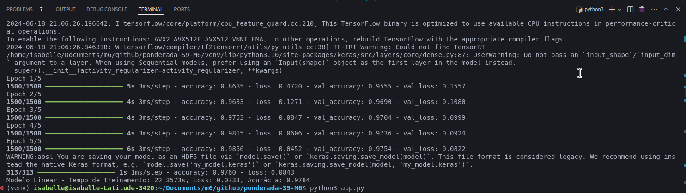
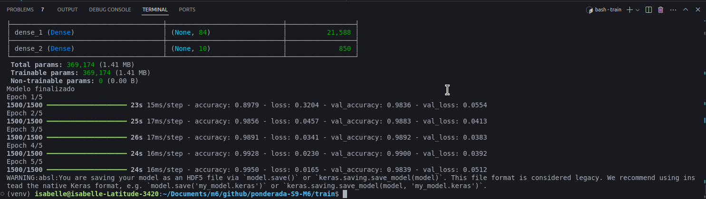

# Aplicação prática de Redes Convolucionais

Desenvolvido por Isabelle Oliveira

## Treinamento

Para o desenvolvimento desse projeto, foram treinados dois modelos, um modelo linear e outro modelo CNN LeNet. Os arquivos com os codigo de treinamento podem ser encontrados na pasta `train` e os arquivos dos modelos já treinados são encontrados na pasta `models`. Ambos os modelos foram treinados com 5 epocas.

`linear_modelo_mnist.h5`: arquivo do modelo linear treinado
``model_mnist.h5`: arquivo do modelo CNN LeNet treinado

Os resultados dos modelos treinados podem ser encomtrados a seguir:

Modelo Linar

    

Modelo CNN LeNet

    

## Aplicação Flask

Para o teste desse projeto, foram realizadas rotas que permitem o upload de imagens para predição por meio dos modelos treinados. Essas rotas foram contruidas por meio do flask que permitem essa análise por meio do upload de imagens em uma interface web simples, construida em html e que retorna as análises realizadas com cada modelo.

As rotas são encontradas no arquivo `app.py` e a página html é encontrada em `templates/index.html`.

### Rotas

**Rota GET /**:

Descrição: Esta rota serve a página principal do aplicativo.

Função: Renderiza o template index.html, que contém o formulário para o upload da imagem e o botão para comparar os modelos.

Método HTTP: GET

Função Associada: index()

**Rota POST /upload_and_compare**:

Descrição: Esta rota recebe a imagem enviada pelo usuário, realiza a predição usando os dois modelos (CNN e Linear), e retorna os resultados das predições junto com o tempo de inferência de cada modelo.

Função: Processa o upload da imagem, redimensiona e converte para escala de cinza. Realiza a predição com o modelo CNN e o modelo Linear, calcula o tempo de inferência para cada modelo e retorna os resultados em formato JSON.

Método HTTP: POST

Função Associada: upload_and_compare()

Processo:
Recebe a imagem enviada pelo usuário.
Converte e redimensiona a imagem para o formato esperado pelos modelos.
Realiza a predição com o modelo CNN e mede o tempo de inferência.
Realiza a predição com o modelo Linear e mede o tempo de inferência.
Retorna um JSON contendo as predições e os tempos de inferência dos dois modelos.

## Como executar o programa: 

- Clone este repositorio por meio do seguinte comando: `git clone https://github.com/IsabelleVOliveira/ponderada-S9-M6.git `

- Instale todas as dependencias por meio desse comando: `python3 -m pip install keras numpy matplotlib tensorflow jupyterlab np_utils opencv-python flask`

- Abra um um terminal e execute o comando: `python3 app.py`

Após isso, clique no link gerado para visualizar a aplicação em seu navegador e faça o upload de uma imagem do seu computador.

O funcionamento desse projeto foi demosntrado no link a seguir: https://drive.google.com/file/d/1pdscmKtYtE-WbUDpWtnYNs5V4fOw0NbW/view?usp=sharing

